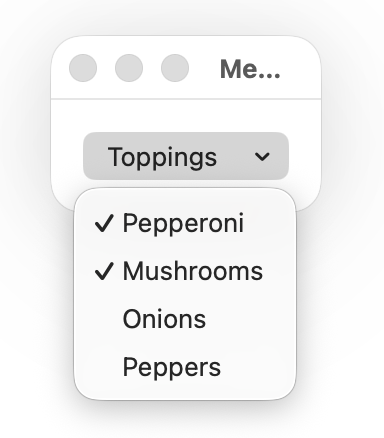
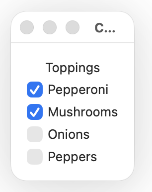
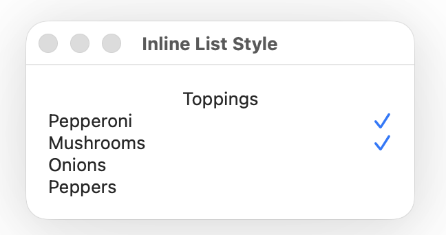
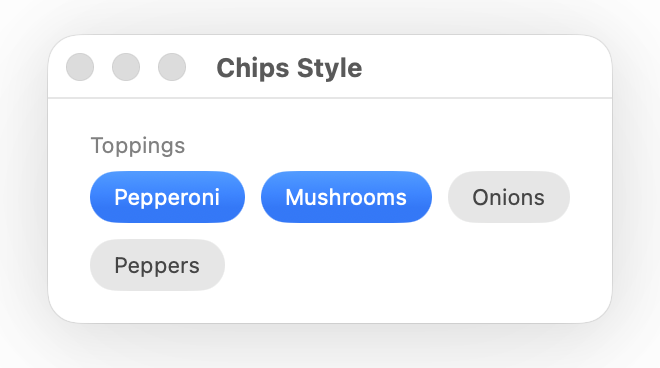

# MultiPicker

A SwiftUI multi-selection picker with an extensible style system. Choose from built-in styles or create your own.


## Requirements

- iOS 17+ / macOS 14+
- Swift 6.2+

## Installation

Add MultiPicker to your Swift package dependencies:

```swift
dependencies: [
    .package(url: "https://github.com/yourusername/MultiPicker.git", from: "1.0.0")
]
```

Then add it to your target:

```swift
.target(name: "MyApp", dependencies: ["MultiPicker"])
```

## Quick Start

```swift
import MultiPicker

enum Topping: String, CaseIterable, Hashable, CustomStringConvertible {
    case pepperoni, mushrooms, onions, peppers

    var description: String { rawValue.capitalized }
}

struct OrderView: View {
    @State private var toppings: Set<Topping> = []

    var body: some View {
        MultiPicker("Toppings", sources: Topping.allCases, selection: $toppings)
    }
}
```

## Initializers

MultiPicker provides three initializer flavors, each accepting either a `String` or `LocalizedStringKey` title.

### ViewBuilder (full control over labels)

```swift
MultiPicker("Colors", sources: colors, selection: $selected) { color in
    HStack {
        Circle().fill(color.value).frame(width: 12, height: 12)
        Text(color.name)
    }
}
```

### KeyPath (text label from a property)

```swift
MultiPicker("Languages", sources: languages, selection: $selected, labelKeyPath: \.name)
```

### CustomStringConvertible (zero-configuration)

```swift
MultiPicker("Toppings", sources: Topping.allCases, selection: $toppings)
```

This initializer is available when `SelectionValue` conforms to `CustomStringConvertible`.

## Default Styles

Apply a style with the `.multiPickerStyle(_:)` modifier. The default style is `.menu`.

| Style       |                                       |
| ----------- | ------------------------------------- |
| `.menu`     |          |
| `.checkbox` |  |
| `.inline`   |      |
| `.chips`    |        |


## Custom Styles

Create your own style by conforming to `MultiPickerStyle`:

```swift
struct TagMultiPickerStyle: MultiPickerStyle {
    func makeBody(configuration: MultiPickerStyleConfiguration) -> some View {
        VStack(alignment: .leading) {
            configuration.title
                .font(.headline)

            ForEach(configuration.options) { option in
                Button {
                    option.toggle()
                } label: {
                    HStack {
                        Image(systemName: option.isSelected ? "tag.fill" : "tag")
                        option.label
                    }
                }
            }
        }
    }
}

extension MultiPickerStyle where Self == TagMultiPickerStyle {
    static var tags: TagMultiPickerStyle { .init() }
}
```

Then use it like any built-in style:

```swift
MultiPicker("Categories", sources: categories, selection: $selected)
    .multiPickerStyle(.tags)
```

### Configuration

`MultiPickerStyleConfiguration` provides everything a style needs to render:

| Property | Type | Description |
|---|---|---|
| `title` | `Text` | The picker's title |
| `options` | `[Option]` | All available options |

Each `Option` exposes:

| Property | Type | Description |
|---|---|---|
| `id` | `AnyHashable` | Stable identifier |
| `label` | `AnyView` | The option's label view |
| `isSelected` | `Bool` | Current selection state |
| `toggle()` | Method | Toggles this option's selection |

## License

MIT
